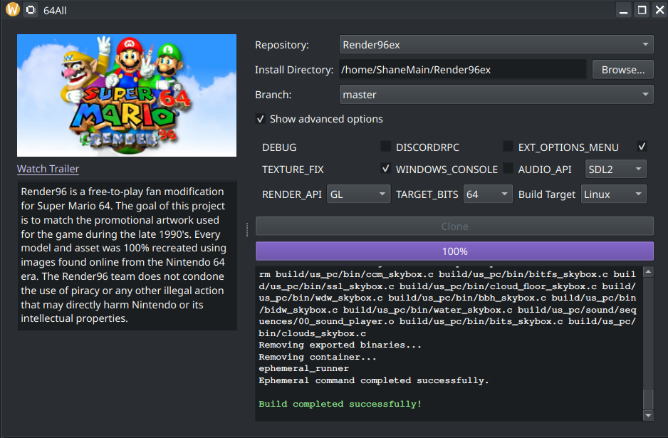

# 64All

64All is a project aimed at simplifying the process for Linux users, particularly Steam Deck users, to play the PC
version of Super Mario 64. This project also offers information about various available forks and provides a unified,
extensible platform for distributing all these excellent projects. This is accomplished by offering a user-friendly GUI
and leveraging Distrobox to containerize the installation process, thereby keeping the footprint minimal and the process
straightforward.

  

## Features

- **Minimal Footprint**: Handles all builds within Distrobox containers.
- **Multi-Repository Support**: Supports multiple Super Mario 64 PC port repositories.
- **Customizable Build Options**: Users can easily select desired build options.
- **Advanced Configurations**: Supports advanced build configurations.
- **User-Friendly Interface**: Provides repository information and trailers in an easy-to-use UI.

## Usage

Download and run the executable from the latest release

## How it Works

1. Select a repository from the dropdown menu.
2. Choose the clone directory or use the default.
3. Select the desired branch (if applicable).
4. Configure build options as desired.
5. Click the **"Build"** button to start the process.
6. Once cloning is complete, the build process will automatically begin. Be patient, it takes a little while for the
   build container to spin up.

## Contributing

Contributions welcome!

64All is designed with extensibility in mind, allowing for easy addition of new features and support for additional
repositories. Here are some key aspects of its extensible architecture:

1. **Modular Design**: The project is structured into separate modules for UI, git operations, build management, and
   repository handling.
2. **Repository Configuration**: New repositories can be added by creating YAML configuration files in the
   `config/repos` directory.
3. **Dynamic UI Generation**: The UI for build options is generated dynamically based on the repository configuration.
4. **Flexible Build System**: The build system accommodates various build processes to adapt to different Super Mario 64
   forks and their unique build requirements.
5. **Customizable Theming**: The application supports light and dark themes, with a color mapping system for additional
   custom themes.
6. **Event-Driven Architecture**: Uses Qt's signal-slot mechanism for loose coupling between components, making it
   easier to add new features or modify existing ones.

## Disclaimer

This project is not affiliated with Nintendo or any official Super Mario 64 releases. It is intended for educational and
personal use only. All work contained within this project is the sole property of the project author. No Nintendo assets
or intellectual property are distributed in this project. Any use of this project should comply with relevant laws and
respect the intellectual property rights of Nintendo and other parties. Users are responsible for ensuring that their
use of the project does not infringe on any third-party rights.